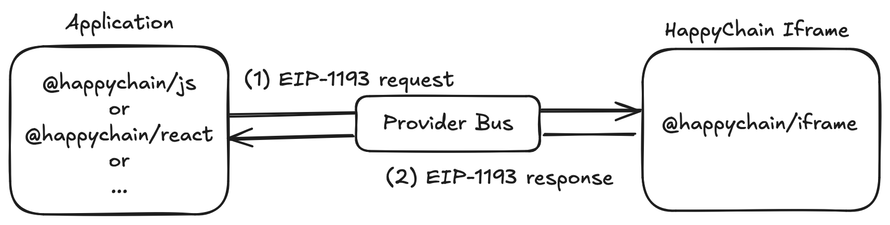
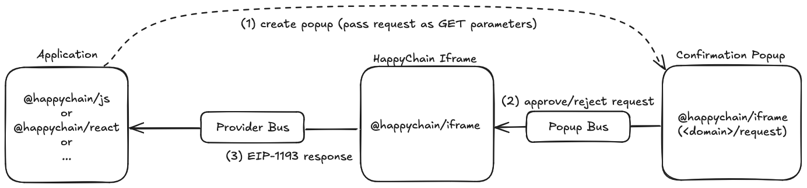

# Happy Account Architecture

<!-- TOC -->
* [Happy Account Architecture](#happy-account-architecture)
  * [What is the Happy Account?](#what-is-the-happy-account)
  * [Overview](#overview)
  * [EIP-1193 Wallet Provider](#eip-1193-wallet-provider)
    * [Injected Wallets — Handling Requests](#injected-wallets--handling-requests)
    * [Social Wallet — Deriving a Private Key](#social-wallet--deriving-a-private-key)
    * [Social Wallets — Handling Requests](#social-wallets--handling-requests)
    * [Implementation Details](#implementation-details)
  * [Authentication & Connection](#authentication--connection)
<!-- TOC -->

## What is the Happy Account?

The Happy Account is a global account for all applications on HappyChain.

The account is a [Boop-powered](../contracts/src/boop/README.md) smart contract wallet controlled by a private key (EOA). The private key
can be derived from a social account (Google, Twitter, Discord, ...) or come from a browser-injected
wallet extension like Metamask. The social account solution is non-custodial via seamless 2FA.

<!-- TODO mention the social login provider once it is decided -->

Transacting with EOA on HappyChain is supported but not encouraged for end users.

Applications enable support for the Happy Account by permissionlessly embedding the Happy wallet on
their apps via our SDK. Currently, only web apps — desktop or mobile — are supported. Support for
native apps (Android, iOS, Unity, ...) is planned for the future.

Our SDK currently has the following entrypoints:

- [`@happy.tech/core`](https://www.npmjs.com/package/@happy.tech/core) contains most functionalities relating to the Happy Account, as well as tools for framework-agnostic integration
- [`@happy.tech/book-sdk`](https://www.npmjs.com/package/@happy.tech/boop-sdk) for interacting with Boop
- [`@happy.tech/react`](https://www.npmjs.com/package/@happy.tech/react) for applications built with React
- [`@happy.tech/vue`](https://www.npmjs.com/package/@happy.tech/vue) for applications built with Vue

Note that the React SDK also re-exports everything exposed by the vanilla JS SDK.

Beyond enabling the creation and interactions with the HappyAccount, the SDK also provides an
embedded wallet UI similar to that of injected wallets (Metamask & co), allowing them to track
their tokens, view transaction history, make transfers, and more.

## Overview

This document describes the architecture of the Happy Account as implemented by our SDK.

At the moment, the smart contract wallet is not yet implemented, so we only describe how the SDK
provides a unified interface to sign transactions with an EOA (sourced from either an injected
wallet or the social login solution). This document is to be updated once the smart contract wallet
is integrated into the SDK.

Our [documentation site](https://happychain.pages.dev/) provides guides on how to integrate the
happy wallets into your applications, as well as a full API reference. We will be referencing
some of the exposed API in this document.

## EIP-1193 Wallet Provider

Applications communicate with a signer via the [`happyProvider`], an [EIP-1193 wallet
provider][1193] to which unsigned JSON-RPC requests are sent.

[`happyProvider`]: https://happychain.pages.dev/js/api/variables/happyProvider
[1193]: https://eips.ethereum.org/EIPS/eip-1193

These requests broadly fall into two buckets:

1. Unsigned versions of the [Ethereum JSON-RPC][jsonrpc] transaction (e.g. `eth_sendTransaction`)
2. Wallet feature requests (e.g. `eth_requestAccounts` or `wallet_requestPermissions`)

[jsonrpc]: https://ethereum.org/en/developers/docs/apis/json-rpc/

The Happy Account supports two types of signers:

1. Browser-injected wallets (e.g. Metamask)
2. The embedded HappyChain social login signer

> ⚠️ The term "wallet" is overloaded, as it can refer to this signer, the address holding assets
> (either an EOA or a smart contract), or both.
>
> We use the term "Happy Account" to refer to the smart contract holding assets and whose address
> represents the user. The "signer" is the mechanism used to obtain an EOA controlling the Happy
> Account, and to sign transactions on its behalf.
>
> Since it's hard to go against habits and the prevailing terminology, we will use the terms
> "injected wallets" and "social wallet" to refer to the two types of signers, and "wallet" for
> a signer, when there is no ambiguity.

### Injected Wallets — Handling Requests

When using an injected wallet, the `happyProvider` forwards the request to the injected wallet.
This is the traditional flow that web3 users are familiar with.

> Because we support account abstraction through Boop, things might look a little bit different. Most wallets don't have
> built-in account abstraction support at the UI level, and so the usual transaction request is replaced by a
> signing request over a byte string representing a boop. It's not ideal to not
> know what you are signing, and so we will display our own pre-confirmation popup before routing
> the user to their injected wallet.

### Social Wallet — Deriving a Private Key

Before discussing how the social wallets handles requests, let's give an overview of how social
wallets work.

Social wallets use one of your social accounts to create a private key (EOA) for you. This is done
by cryptographically splitting the key in multiple "shares". It's a little bit like a multisig
wallet, except that the shares can be recombined to reconstruct the private key (Shamir's secret
sharing, or SSS) or be used in a secure multi-party computation (MPC) to sign a transaction with the
key without any party holding a share being able to reconstruct the key (threshold signing scheme,
or TSS).

These schemes are very flexible — you can split the keys in any number of shares, and require any
quorum on these shares to reconstruct the key or sign a transaction.

On creation, the Happy Account uses a 2-out-of-2 share split between a social share and a local
share. The social share is held by the HappyChain team, and it only uses it if you successfully
authenticate with your social account. The local share is held on your browser's local storage.

> We will switch to storing the local share into device's secure enclave for devices that have them
> as soon as this becomes possible from the browser.

This mechanism means the HappyChain team can't access your funds without your consent.

As you start accruing funds into you wallet, a permanent warning header will appear in the wallet UI
prompting you to add a third share to your key, making it a 2-out-of-3 key. The third key acts as a
protection against the loss of your social account, the loss of your local share or device, or
disruptions of the Happy Account social login service.

<!-- TODO a different page about security, as it pertains to notably the possibility to hijack the
     local share via a DNS attack, malicious code and browser extensions -->

### Social Wallets — Handling Requests

When using the social wallet, the mechanism for handling requests involves three "pages":

1. The application, controlled by third-party app developers, and importing our SDK.
2. The Happy Account iframe, controlled by the HappyChain team, and embedded into the application.
3. The Happy Account confirmation popup, controlled by the HappyChain team, and opened by the
   application.

The use of an iframe is required for security reasons: the local browser storage associated with the
iframe's domain holds the local share, which should not accessible to third-party applications. The
iframe code also holds user information (like their social account name) that he might not want to
automatically share with the application — an explicit authorization by connecting to the
application is required.

> Depending on which social wallet provider we end up using, the local share might actually be
> stored in another iframe, nested inside the Happy Account iframe.

The iframe also enables to user to log in only once to their social account, then to connect to any
app by simply clicking a confirmation button in the popup.

The use of a popup is required for anything that requires the user's approval (connecting to an app,
transaction confirmation, ...). Otherwise, malicious applications could trick users into approving
unintended transactions: they could paint over an in-app approval dialog with fake information (e.g.
replacing the transferred amount) or trick the users to click the approval button by overlaying
another element on top of it.

Some requests do not require user confirmation, for instance reading information from onchain
contracts. In this case, The flow between the pages looks like this:

Because no confirmation is required, the popup is not involved at all. The app sends the request
directly to the iframe, which processes it (potentially sending a JSON-RPC request to an HappyChain
node itself), and it then returns the response (or an error) to the app.

Whenever a user confirmation is required (e.g. signing a transaction or connecting to the app), the
flow looks like this:

In this case, the app creates the confirmation popup, passing it the details of the request in the
URL. If the user clicks the "Approve" or "Reject" button in the popup, the popup sends a message to
the iframe, informing it of the user decision. The iframe then processes the request, and sends the
result (or an error — including when the user rejected the request) back to the app.

The app and the iframe communicate via the *provider bus*, and the iframe and popup communicate
via the *popup bus*. The app creates the popup and communicates the request via GET parameters on
the URL.

Note that the app and the iframe also communicate over a separate bus (the *message bus*) which is
used for everything that isn't EIP-1193 requests (UI logic, sending user information to the app,
...). There is nothing that technically prevents us from using the same bus, using two separate
buses makes the code clearer and safer (we have strict type checking on the messages sent over the
various buses).

### Implementation Details

The implementation of this provider system is split between the following packages

- `@happy.tech/wallet-common` — logic shared between the `@happy.tech/iframe` and
  `@happy.tech/core` packages.
- `@happy.tech/iframe` code that runs in the iframe as well as in the popup.
- `@happy.tech/core` or `@happy.tech/react` — code that runs in the application.

The communication buses are implemented using the [BroadcastChannel API]. Their implementation
lives in `@happy.tech/wallet-common`.

[BroadcastChannel API]: https://developer.mozilla.org/en-US/docs/Web/API/Broadcast_Channel_API

<!-- TODO

- in the code: Msgs and payload enums

-->

## Authentication & Connection

There are two separate concepts here:

1. *Authentication* refers to the user being logged into their Happy Account in the iframe.
2. *Connection* refers to the user connecting the app to the Happy Account.

This is very analogous to how Metamask & co. work: authentication is akin to selecting an account
(public key), while connection is akin to connecting an account to an app. The difference is that
Metamask always has an account selected, while the Happy Account can be unauthenticated.

Authentication with an injected wallet consists of connecting the app to the injected wallet.

Authentication with a social wallet consists of logging into your social account and deriving an EOA
from there.

Because connection binds the app to an Happy Account, and authentication is what selects this
account, you cannot be connected without being authenticated.

Authentication with social wallets pertains to the iframe, and as such once authenticated, you'll be
authenticated in any app using the HappyChain SDK — however the app can't get access to any of your
information without your assent.

Connection signals the user's assent to disclose their information (account address, social login
account name) to the app, and let it suggest transactions to sign.

Connection to an app is persistent (on the same device) until the user explicitly disconnects. The
iframe will remember your app connection status, so if you become unauthenticated, then authenticate
with the same method again on the same app, you will become automatically connected.

### Authentication From An App (Embedded Iframe)

When authenticating from an app, the connection is granted automatically, however this connection can
be revoked, or granted again at any time and is handled on a per-app basis.

While disconnected, any action that requires connection first (such as viewing a users address, or 
making a transaction) will prompt the user to either authenticate themselves using either their 
injected or social wallet if they have not yet done so, or else approve the connection request. If 
this is the first time they have authenticated using a social wallet a new EOA will be generated 
automatically, otherwise the existing account will be used. The authentication prompt itself lives 
within the secure iframe.

When a social wallet option is selected (such as 'Sign In With Google'), the familiar oauth popup 
will be shown and the user will continue with the traditional OAuth flow. Once successful, a JWT 
will be available to the iframe and used to initialize a Web3Auth 
[EIP-1193 Wallet Provider](#eip-1193-wallet-provider). From this point on, unless unauthenticated or 
disconnected, all web3 calls will be passed to this provider.

When an injected wallet option is selected (such as Metamask), an `InjectedProviderProxy` is initialized
within the iframe. This implementation functions similarly to the Web3Auth provider at a high level. However, instead of directly executing requests, it proxies all requests back to the app, where they
are executed using the user's selected injected wallet. This approach ensures that requests 
originating from either the app or the iframe are handled uniformly on the app side.

### Authentication From The Wallet (Direct Access)

When accessing the wallet directly, most of the flow follows the same as the [app](#Authentication-From-An-App-\(Embedded-Iframe\)). The main difference
is for injected wallets since instead of proxying calls to the app to be executed, the wallet will
call the injected wallet directly to execute requests.

<!-- TODO

- describe UI components (badge), `connect`, `disconnect`
  - badge will say "connect" when unauthenticated or not connected

- in the code: key atoms, key flows

- section on permissions and how the connected status is implemented via permissions

-->

