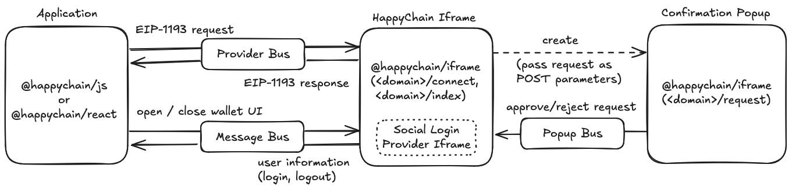

# Happy Account Architecture

The Happy Account is a smart contract wallet designed to be the primary form of account on
HappyChain. Externally owned accounts (EOAs) are supported, but not encouraged for end users.

Applications on HappyChain should integrate the Happy Account via our SDK either by importing the
`@happychain/js` or `@happychain/react` NPM packages.

<!-- TODO provide links to the NPM packages once deployed to the registry -->

The Happy Account is controlled via an EOA. Our SDK enables creating or controlling accounts either
via a browser-injected wallet (Metamask, Rabby, etc.) or via a noncustodial social account login
solution provided by our SDK.

<!-- TODO mention the social login provider once it is decided -->

This document describes the architecture of the Happy Account as implemented by our SDK.

At the moment, the smart contract wallet is not yet implemented, so we only describe how the SDK
provides a unified interface to sign transactions with an EOA (sourced from either an injected
wallet or the social login solution). This document is to be updated once the smart contract wallet
is integrated into the SDK.

## Interface

### Vanilla JS / Typescript SDK

The `@happychain/js` package exposes the following members:

- HTML
  - happy-wallet` — A web component that adds the HappyChain iframe to the page. The iframe is hidden
    by default.
- Javascript / Typescript
  - `register()` — A function that adds the `happy-wallet` web component to the page (not necessary if
    you include your component on the page directly).
  - `happyProvider` — An [EIP-1193] provider that can be used to interact with the HappyChain
    blockchain.
  - `onUserUpdate(callback: (user: HappyUser | null) => void)` — Registers a callback called
    with user information whenever the user logs in or logs out (`null` on logout). 
    (login, logout). The callback is called with the user object when the user logs in or out.
  - `HappyUser` — type for the user object returned by the `onUserUpdate` callback, containing user
    information. This provider can be passed to blockchain interaction libraries like Viem or
    Ethers.js.

<!-- TODO: update once the button is not in the iframe and we have a method to open/close the wallet -->

[EIP-1193]: https://eips.ethereum.org/EIPS/eip-1193

For more details & examples, see the [@happychain/js README](../packages/sdk-vanillajs/README.md).

### React SDK

The `@happychain/react` package exposes the following members:

- Javascript / Typescript
  - `useHappyChain(): { provider: EIP1193Provider, user: HappyUser | null }: ` — A hook that
    returns the provider (cf. `happyProvider` above) and the user object (cf. `HappyUser` above).
  - `onUserUpdate(callback: (user: HappyUser | null) => void` — As in the vanilla SDK.
  - `HappyUser` — As in the vanilla SDK.

For more details & examples, see the [@happychain/react README](../packages/sdk-react/README.md).

## Architecture

When using injected wallets, the Happy Account provider forwards the request to the injected wallet
provider, which uses the injected wallet's UI for confirmation (e.g. Metamask).

<!-- NOTE: This isn't as-implemented yet, at the moment injected wallet request do travel to the
     iframe, but this is slated to change. -->

When using social login, things are more involved:

At runtime, frontend code for the Happy Account lives in three locations ("browsing contexts"):

1. In the application.
2. In the Happy Account iframe.
3. In the Happy Account confirmation popup.

The use of an iframe is required for security reasons: social login providers require whitelisting origin
domains because the originating domain can approve any transaction, and we can't let
any application approve arbitrary transactions on behalf of the user after he logs in.

(Social login providers also implement their own iframes, to shield the "user device
share" from the application (in this case the application is HappyChain itself) — so there is an
iframe inside the iframe).

The use of a popup is required for transaction confirmation because otherwise malicious applications
could use their UI to trick users into approving unintended transactions: they could paint over the
approval dialog with a fake one to hide information (e.g. the real transfer amount) or to trick the
user into clicking "Approve" by overpainting a different button over it.

These three locations communicate with each other via three communication buses:

1. The EIP1193 provider bus — proxies EIP1193 requests and responses from the application to the iframe.
2. The dapp message bus — transmits other events between the application and the iframe. Currently,
   this is used to communicate user information to the app (as exposed via `onUserUpdate`) and to
   communicate transitions in the wallet interface from the dapp to the iframe (currently:
   opening/closing the wallet modal).
3. The popup bus — used to communicate between acceptance of rejection of a signing request from the
   confirmation popup to the iframe.

These buses are implemented using the [BroadcastChannel API].

[BroadcastChannel API]: https://developer.mozilla.org/en-US/docs/Web/API/Broadcast_Channel_API

In terms of code organization, the SDK is split betwen the following packages:

- `@happychain/sdk-core` — contains logic shared between the `@happychain/iframe` and
  `@happychain/js` packages.
- `@happychain/iframe` — contains the code that runs in the iframe as well as in the popup.
- `@happychain/js` — framework-agnostic SDK, contains the code that runs in the application.
- `@happychain/react` — React-specific SDK, built on top of `@happychain/js`.

