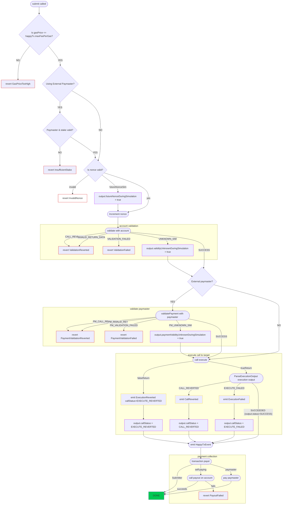

# Boop Validation Flowchart
This flowchart depicts the various reverts and output statuses of the Boop Entrypoint: 

```mermaid
flowchart TB
    subgraph accountValidation["account validation"]
        ValidateAccount(["validate with account"])
        ValidateAccountReverted["revert ValidationReverted"]
        ValidateAccountFailed["revert ValidationFailed"]
        UnknownDuringSim["output.validityUnknownDuringSimulation = true"]    
    end

    subgraph paymasterValidation["validate paymaster"]
        ValidatePaymaster(["validatePayment with paymaster"])
        PaymentValidationReverted["revert PaymentValidationReverted"]
        PaymentValidationFailed["revert PaymentValidationFailed"]
        PaymentUnknownDuringSim["output.paymentValidityUnknownDuringSimulation = true"]
    end

    subgraph executeCall["execute call to target"]
        CallExecute(["call execute"])
        CallExecuteRevert["emit ExecutionReverted callStatus=EXECUTE_REVERTED"]
        CallStatus["output.callStatus = EXECUTE_REVERTED"]
        ParseExecutionOutput(["ParseExecutionOutput execution output"])
        CallRevert["emit CallReverted"]
        CallExecutionFailed["emit ExecutionFailed"]
        OutputCallReverted["output.callStatus = CALL_REVERTED"]
        OutputExecuteFailed["output.callStatus = EXECUTE_FAILED"]
    end

    subgraph paymentCollection["payment collection"]
        TransactionPayer(["transaction payer"])
        CallAccountPayout(["call payout on account"])
        PayPaymaster(["pay paymaster"])
        RevertPayoutFailed["revert PayoutFailed"]
    end

    CallExecuteRevert --> CallStatus

    Submit(["submit called"]) --> IsGasPriceTooHigh{"Is gasPrice <= happyTx.maxFeePerGas?"}
    IsGasPriceTooHigh -- NO --> GasPriceTooHigh["revert GasPriceTooHigh"]
    IsExternalPaymaster{"External paymaster?"}
    UnknownDuringSim --> IsExternalPaymaster
    IsGasPriceTooHigh -- YES --> UsingExternalPaymaster{"Using External Paymaster?"}
    UsingExternalPaymaster -- YES --> IsStakeValid{"Paymaster & stake valid?"}
    UsingExternalPaymaster -- NO --> CheckNonce{"Is nonce valid?"}
    IsStakeValid -- NO --> InsufficientStake["revert InsufficientStake"]
    IsStakeValid -- YES --> CheckNonce
    CheckNonce -- invalid --> InvalidNonce["revert InvalidNonce"]
    CheckNonce -- futureNonceSim --> FutureNonce["output.futureNonceDuringSimulation = true"]
    FutureNonce --> IncrementNonce(["Increment nonce"])
    CheckNonce -- yes --> IncrementNonce
    IncrementNonce --> ValidateAccount
    ValidateAccount -- CALL_REVERTED --> ValidateAccountReverted
    ValidateAccount -- INVALID_RETURN_DATA --> ValidateAccountReverted
    ValidateAccount -- VALIDATION_FAILED --> ValidateAccountFailed
    ValidateAccount -- UNKNOWN_SIM --> UnknownDuringSim
    ValidateAccount -- SUCCESS --> IsExternalPaymaster
    IsExternalPaymaster -- YES --> ValidatePaymaster
    ValidatePaymaster -- PM_CALL_REVERTED --> PaymentValidationReverted
    ValidatePaymaster -- PM_INVALID_RET --> PaymentValidationReverted
    ValidatePaymaster -- PM_VALIDATION_FAILED --> PaymentValidationFailed
    ValidatePaymaster -- PM_UNKNOWN_SIM --> PaymentUnknownDuringSim
    PaymentUnknownDuringSim --> CallExecute
    ValidatePaymaster -- SUCCESS --> CallExecute
    IsExternalPaymaster -- NO --> CallExecute
    CallExecute -- falseReturn --> CallExecuteRevert
    CallExecute -- trueReturn --> ParseExecutionOutput
    ParseExecutionOutput -- CALL_REVERTED --> CallRevert
    ParseExecutionOutput -- EXECUTE_FAILED --> CallExecutionFailed
    CallRevert --> OutputCallReverted
    OutputCallReverted --> happyTxSubmittedEvent(["emit HappyTxEvent"])
    CallStatus --> happyTxSubmittedEvent
    ParseExecutionOutput -- "SUCCEEDED (output.status=SUCCESS)" --> happyTxSubmittedEvent
    CallExecutionFailed --> OutputExecuteFailed
    OutputExecuteFailed --> happyTxSubmittedEvent
    happyTxSubmittedEvent --> TransactionPayer
    TransactionPayer -- Submitter --> DONE["DONE"]
    TransactionPayer -- "self-paying" --> CallAccountPayout
    CallAccountPayout -- succeeds --> DONE
    CallAccountPayout -- fails --> RevertPayoutFailed
    TransactionPayer -- paymaster --> PayPaymaster
    PayPaymaster --> DONE

    style ValidateAccountReverted stroke:#D50000
    style ValidateAccountFailed stroke:#D50000
    style UnknownDuringSim stroke:#AA00FF
    style PaymentValidationReverted stroke:#D50000
    style PaymentValidationFailed stroke:#D50000
    style PaymentUnknownDuringSim stroke:#AA00FF
    style CallExecuteRevert stroke:#FFD600
    style CallStatus stroke:#AA00FF
    style CallRevert stroke:#FFD600
    style CallExecutionFailed stroke:#FFD600
    style OutputCallReverted stroke:#AA00FF
    style OutputExecuteFailed stroke:#AA00FF
    style RevertPayoutFailed stroke:#D50000
    style GasPriceTooHigh stroke:#D50000
    style InsufficientStake stroke:#D50000
    style InvalidNonce fill:transparent,stroke:#D50000
    style FutureNonce stroke:#AA00FF
    style DONE fill:#00C853
```