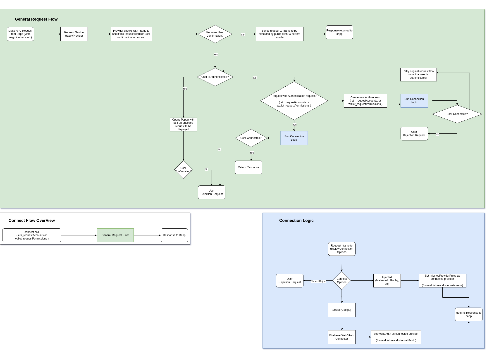

# Connection Flow

<!-- TOC -->
* [Connect Flow Diagram](#diagram)
* [Access Methods](#access-methods)
    * [Direct Access](#direct-access)
    * [App Access](#app-access)
* [Connection Methods](#connection-methods)
    * [Social Wallets](#social-wallets)
    * [Injected Wallets](#injected-wallets)
* [Connection Result](#connection-result)
    * [Success](#success)
    * [Failure](#failure)
<!-- TOC -->

## Diagram

## Access Methods

Wallet access falls into two categories, App Access and Direct Access. App access is the most common
and is used when the wallet is embedded and accessed from within a third party app. Direct access is 
when the wallet is visited directly and the wallet _is_ effectively the app. While in direct access 
mode the terms authentication and connection are synonymous as one cannot exist without the other, 
however when connected to an app they are distinct. It is possible to be authenticated with the 
wallet however the app is not yet connected and is not aware of the user details and cannot process 
sensitive operations without the users connection. When Authenticating in app mode, the wallet will 
auto-connect to the current app. When visiting a subsequent app, the wallet will remain authenticated
however the new app will still need to be connected.

### Direct Access

When accessing the wallet through its standalone interface, only the available authentication 
methods (such as social logins and detected injected wallets) are accessible. No other actions can 
be performed until a successful connection is established.

### App Access

When accessing from an app (via the Happy Orb), the orb will indicate that it is not authenticated, and 
only public actions such as `eth_getBlock` will be processed immediately. If a wallet action such as
`personal_sign`, `eth_requestAccounts`, or `eth_sendTransaction` is requested from the app, a
`WalletVisibility` message is sent via the event bus to signal to the wallet that it should 'open'.
This message forwards to the wallet web component which expands to display the authentication methods 
described above when viewing the wallet directly as a standalone.

## Connection Methods

### Social Wallets

When a Social Wallet selection is made (either embedded through an app or direct wallet access) the 
wallet initiates a standard oauth flow, and receives a JWT from the login provider, which is then 
used to instantiate a Web3Auth provider instance. This provider will be used to process and sign all 
future RPC requests until logout or disconnect.

### Injected Wallets

When an Injected Wallet is selected while accessed through an app, the wallet will emit the [rdns](https://eips.ethereum.org/EIPS/eip-6963#rdns)
of the chosen wallet to the `InjectedWalletWrapper` app-side, where the appropriate EIP-1193 Provider 
will be detected using [EIP-6963](https://eips.ethereum.org/EIPS/eip-6963) and stored for future use. 
Once this provider is connected and saved, the iframe will use the `InjectedWalletProxy` to execute 
any future requests by forwarding them to `InjectedWalletWrapper`. If the iframe was being accessed 
directly and not through an app, then the original user-selected provider will simply be used to 
execute requests directly. When the user 'disconnects' from the app (without logging out), we revoke
the app's connection permission in the Happy Wallet, so that the app can't interact with the Happy Wallet anymore.
However, the injected wallet remains connected to the app, such that we can still use the `InjectedWalletWrapper`/`InjectedWalletProxy` connection to interact with the chain from the Happy Wallet.

## Connection Result

### Success

Once the authentication is successful, a message is sent from the iframe to the app (if available) 
to close the wallet, and if the original request requires signing (e.g. `personal_sign` or
`eth_sendTransaction`) then the connected wallet will prompt for user confirmation. If the request
results can be derived without a user signature (as is sometimes the case for `eth_requestAccounts`) 
then the results will be responded with directly.

### Failure

When no selection is made and the user instead closes the popup, or fails to login, a 
`UserRejectionException` is thrown and if the prompt was initiated by a protected RPC request, this
request will be rejected. If the prompt was simply initiated via the user opening the wallet, then 
the wallet will close and no actions need to be taken.
