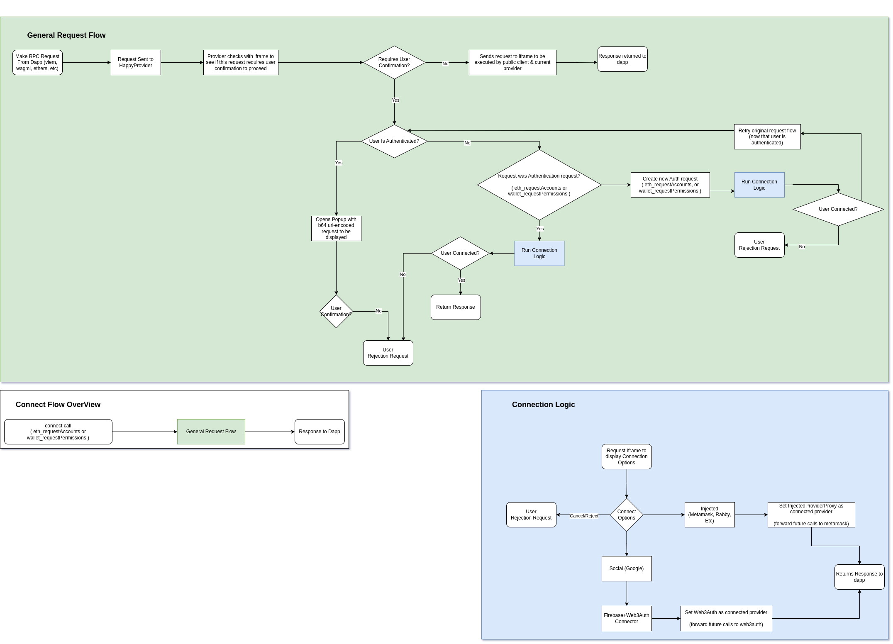

# RPC Calls

Wallet RPC requests can be originated either from a third-party app (such as the 'demos' found in this 
repo) or from the iframe/wallet directly. In addition to this, there are 3 main ways these requests 
can be executed. Regardless of the source of the request, all processing & execution occurs within 
the iframe/wallet.

- publicClient
    - This is a viem public client initialized using an `http` transport when no user is connected
      or initialized using a `custom` transport using the connected user's preferred EIP-1193 provider
      if available.
    - This is responsible for executing requests which do not require user confirmations.
- walletClient
    - This is undefined if no user is connected, or initialized using the users selected provider
      (see [Connections](./connections.md))
    - This is responsible for executing requests which require a signature, or user confirmations.
- injectedClient
    - This is a combination of both of the above, however it strictly passes all requests to a third 
      party injected wallet such as Metamask, so the confirmation security can be relaxed as Metamask
      (or the users preferred wallet) will handle this and have its own rules.

RPC Calls may originate from either an app that has the wallet embedded, or from the wallet itself.
When the call originates from the app, it is done so by sending the request to `happyProvider`. The 
`happyProvider` is a standard EIP-1193 Provider that can be used directly, or used to initialize 
third-party libraries such as viem, ethers, or web3. When it receives a request, HappyProvider will 
first check if a user is connected or not, then if the request itself requires user confirmation. 

If no confirmation is needed, the request will be forwarded directly to the wallet to be processed.

If the request does require confirmation, and no user is connected, it will prompt the user to do so
(see [Connections](./connections.md)), then retry the request after the user has connected. 

If the request does require confirmation and the user is already connected, a popup will be opened
so the user can validate what they will be signing. This popup exists in the same context as the wallet
and can not be manipulated by the app in any way. If the user approves the request, the request will 
then be forwarded to the wallet where it can be processed.

Once the request is ready to be processed inside the wallet (either through one of the above methods, 
or else if the request originated from within the wallet), it'll be passed through the appropriate
middleware stack found in `packages/iframe/src/requests`, and finally be executed using one of the 
clients mentioned at the top of this document.
